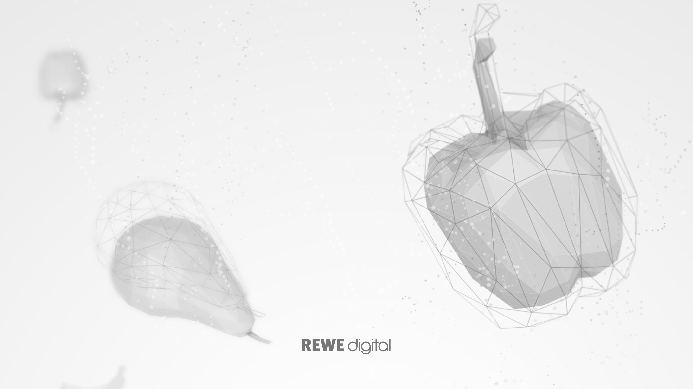
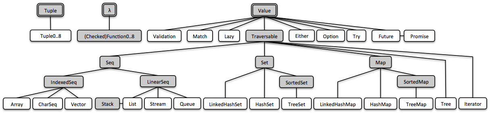

theme: Simple, 1
background-color: #FFFFFF
text: #777777, alignment(left), line-height(1), text-scale(1.0), Titillium Web
header: #25c5dc, alignment(left), line-height(1), text-scale(1.0), Titillium Web
link: #25c5dc, alignment(left), line-height(1), text-scale(1.0), Titillium Web
autoscale: true

[.header: #000000, alignment(center), line-height(1), text-scale(1.0), Titillium Web]

# Java Upside Down
## Functional Programming with Java and Vavr
### Stefan Scheidt, REWE digital

---

> vavr - turns java™ upside down
-- [vavr.io](https://www.vavr.io/)

---

# Three basic types

* Tuple
* Value
* Function

---

# Values

* Option
* Either
* Try
* ...
* Traversable

---

# Traversables

* Seq
* Set
* Map

---

---

# Demo

---

# The End

---

[.header: #000000, alignment(center), line-height(1), text-scale(1.0), Titillium Web]

# Thank you!

### Contact: `stefanscheidt` on [Twitter](https://twitter.com/stefanscheidt) and [GitHub](https://github.com/stefanscheidt)